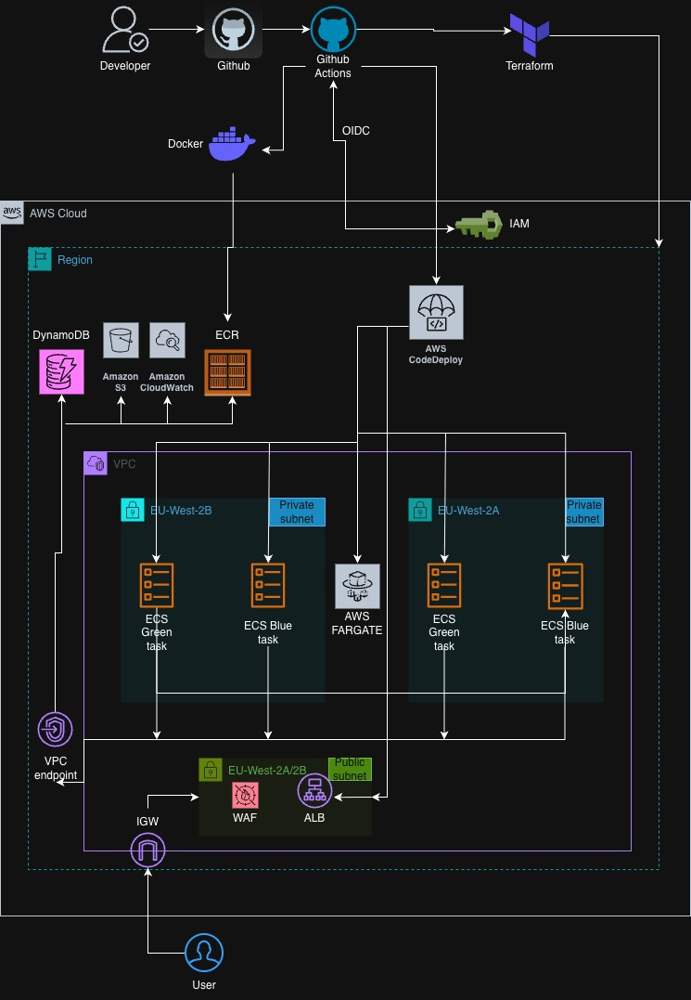
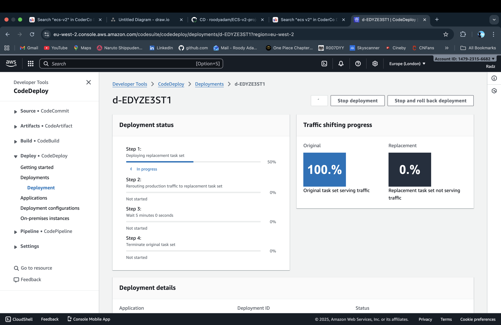
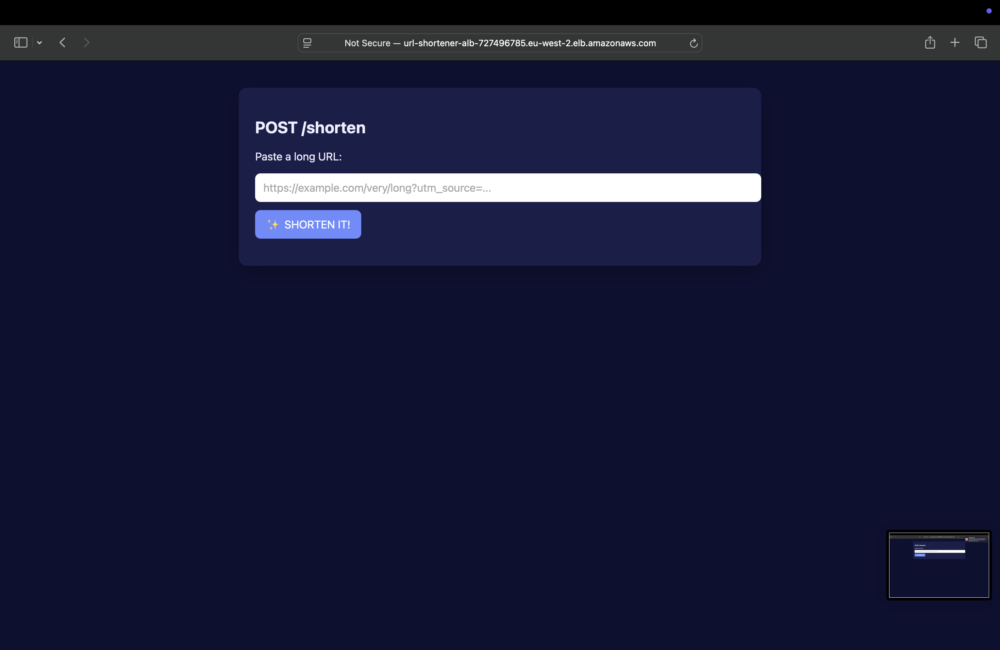
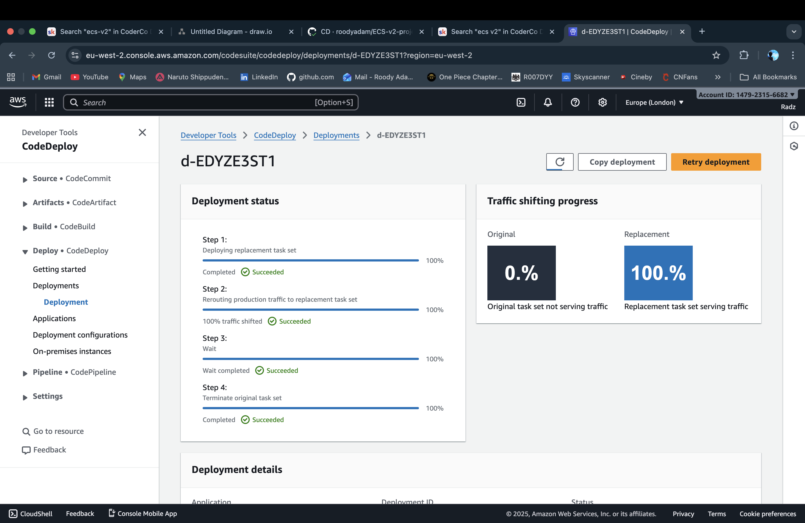
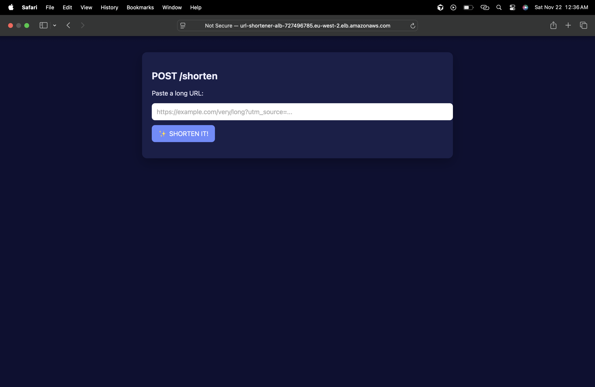

# URL Shortener - ECS V2 Project

A production-ready URL shortener service deployed on AWS ECS Fargate with blue/green deployments, WAF protection, and CI/CD via GitHub Actions OIDC.

## Architecture Overview

- **Compute**: ECS Fargate (no server management, auto-scaling)
- **Load Balancing**: Application Load Balancer (ALB) with AWS WAF
- **Storage**: DynamoDB (PAY_PER_REQUEST, PITR enabled)
- **Networking**: VPC with private subnets only, VPC endpoints (no NAT gateways)
- **Deployments**: AWS CodeDeploy with blue/green strategy
- **CI/CD**: GitHub Actions with OIDC authentication

## Architecture



### Architecture Explanation

This diagram illustrates the complete architecture of the URL shortener service deployed on AWS. The system follows a production-ready, cost-optimized design with security best practices.

**Traffic Flow:**
1. **Internet** → Requests enter through the public internet
2. **AWS WAF** → Filters and protects against common web attacks (SQL injection, XSS, etc.)
3. **Application Load Balancer (ALB)** → Distributes traffic across ECS tasks in two availability zones for high availability
4. **Target Groups (Blue/Green)** → CodeDeploy manages blue/green deployments with two target groups, allowing zero-downtime deployments
5. **ECS Service** → Single ECS service running Fargate tasks in private subnets
6. **ECS Tasks** → Containerized FastAPI application instances running across multiple availability zones

**Networking:**
- **Public Subnets** (2 AZs): Host the ALB with Internet Gateway for inbound traffic
- **Private Subnets** (2 AZs): Host ECS tasks with no public IPs for security
- **VPC Endpoints**: Enable ECS tasks to access AWS services (DynamoDB, ECR, CloudWatch Logs, S3) without NAT gateways, saving ~$64/month

**Data Layer:**
- **DynamoDB**: Stores URL mappings with PAY_PER_REQUEST billing for cost efficiency
- **CloudWatch Logs**: Centralized logging for all application logs

**CI/CD Pipeline:**
- **GitHub Actions**: Automated CI/CD using OIDC authentication (no static credentials)
- **ECR**: Container registry for Docker images
- **CodeDeploy**: Manages blue/green deployments with automatic rollback on failures

**Key Features Highlighted:**
- High availability across 2 availability zones
- Security: Private subnets, WAF protection, least-privilege IAM
- Cost optimization: VPC endpoints instead of NAT gateways, PAY_PER_REQUEST DynamoDB
- Zero-downtime deployments via blue/green strategy
- Production-ready monitoring with CloudWatch

## Blue/Green Deployment Process

The deployment process uses AWS CodeDeploy to manage zero-downtime blue/green deployments:

### Step 1: Deployment Initiated


Deployment starts while the application continues running on the blue target group. Traffic remains on the existing version, ensuring no service interruption.

### Step 2: Application Verification


The application continues to function normally during deployment, serving requests from the blue target group.

### Step 3: Traffic Shift Complete


CodeDeploy shifts traffic to the green target group with the new version. The switch is seamless with no downtime.

### Step 4: Post-Deployment Verification


The application continues working correctly after the traffic shift, now serving from the green target group.

### Benefits

- **Zero Downtime**: Traffic shifts seamlessly between target groups
- **Automatic Rollback**: Failed deployments automatically revert to the previous version
- **Health Checks**: CodeDeploy monitors deployment health and rolls back on failures
- **Gradual Traffic Shift**: Traffic can be shifted incrementally for safer deployments
- **Production Safety**: Old version remains available until new version is verified

## Demo

Watch the application in action: [Demo Video](https://www.loom.com/share/dce56fa7c9c3468e86c68778e4b5ae0f)

This demo showcases the URL shortener service working in production:

- **Live Application**: The service is deployed and accessible via the Application Load Balancer
- **URL Shortening**: Demonstrates creating short URLs from long URLs using the `/shorten` endpoint
- **URL Validation**: Shows the application validating and normalizing URLs before storage
- **Redirect Functionality**: Tests the shortened URL redirect to verify the original URL is correctly retrieved from DynamoDB
- **End-to-End Flow**: Complete workflow from URL submission to successful redirect, demonstrating the full stack integration (ALB → ECS Fargate → DynamoDB)

The demo validates that all components are working together: the FastAPI application, ECS tasks, DynamoDB storage, and the load balancer routing traffic correctly.

## Project Structure

```
ECS-V2-Project/
├── app/                    # Application code
│   ├── src/               # Python FastAPI application
│   ├── tests/             # Unit tests
│   ├── Dockerfile         # Container definition
│   └── requirements.txt   # Python dependencies
├── infra/                 # Terraform infrastructure
│   ├── global/            # Global infrastructure (run once)
│   │   ├── backend/       # Terraform state backend
│   │   └── bootstrap/     # GitHub OIDC provider & deploy role
│   ├── modules/           # Reusable Terraform modules
│   │   ├── vpc/          # VPC, subnets, endpoints
│   │   ├── dynamodb/     # DynamoDB table
│   │   ├── iam/          # IAM roles
│   │   ├── ecr/          # ECR repository
│   │   ├── alb/          # ALB + WAF
│   │   ├── ecs/          # ECS cluster, service, tasks
│   │   └── codedeploy/   # CodeDeploy app & deployment group
│   └── envs/dev/         # Environment-specific configuration
├── .github/workflows/     # GitHub Actions CI/CD
│   ├── ci.yml            # Build, test, scan, push to ECR
│   ├── cd.yml            # Terraform apply, CodeDeploy
│   └── destroy.yml       # Terraform destroy (manual trigger)
└── README.md             # Project documentation
```

